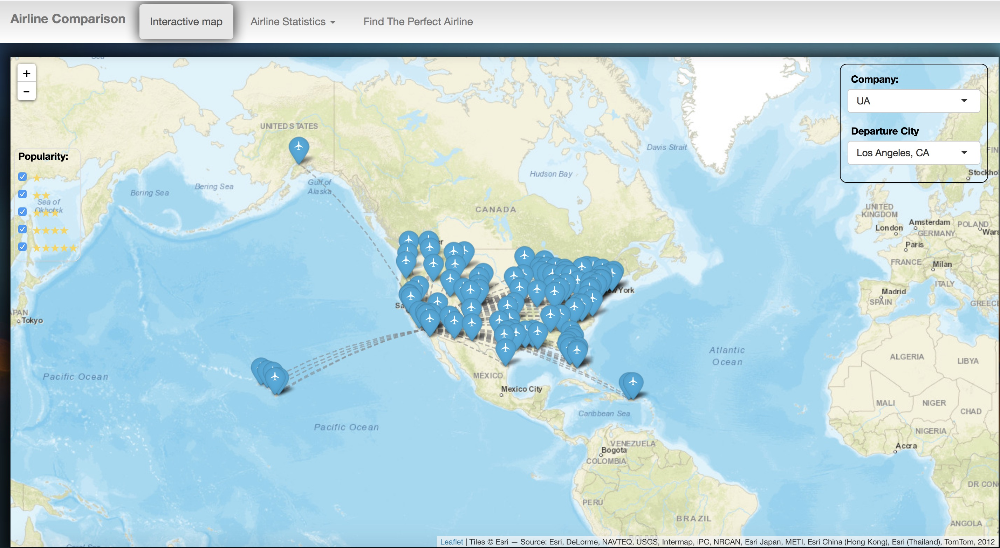

# Project 2: Open Data App - an RShiny app development project

### [Project Description](doc/project2_desc.md)


In this second project of GR5243 Applied Data Science, we develop an *Exploratory Data Analysis and Visualization* shiny app on a topic of your choice using U.S. government open data released on the [data.gov](https://data.gov/) website. See [Project 2 Description](doc/project2_desc.md) for more details.  

The **learning goals** for this project is:

- business intelligence for data science
- data cleaning
- data visualization
- systems development/design life cycle
- shiny app/shiny server

*The above general statement about project 2 can be removed once you are finished with your project. It is optional.

## Project Title: Open Data App - an RShiny app development project
Term: Spring 2018

+ Team #
+ **Projec title**: + Team members
	+ team member 1: Hongyu Li
	+ team member 2: Jingyi Wang
	+ team member 3: Du Guo
	+ team member 4: Qianli Zhu
	+ team member 5: Yiran Jiang

+ **Project summary**: Airplane is a very popular transportation tool.  In this project, we developed a new app which helps people make their flight plan, with high utility and accuracy.

+ **Contribution statement**: ([default](doc/a_note_on_contributions.md)) All team members contributed equally in all stages of this project. All team members approve our work presented in this GitHub repository including this contributions statement. Here is their statement:
Hongyu Li: "I finished the tab named "Find the perfect airline" and ploted parcoordinates for recommendation."
Jingyi Wang: "I finished the Whole project User Interface ; Interactive Map data cleaning and server."
Qianli Zhu: "I finished the work of page designing and feature building for Tab1."
Yiran Jiang: "I finished the code part of Tab2 with Du Guo and contributed to data mining and cleaning."
Du Guo: "I finished the code part of Tab2 with Yiran Jiang and contributed to image processing."



Following [suggestions](http://nicercode.github.io/blog/2013-04-05-projects/) by [RICH FITZJOHN](http://nicercode.github.io/about/#Team) (@richfitz). This folder is orgarnized as follows.

```
proj/
├── app/
├── lib/
├── data/
├── doc/
└── output/
```

Please see each subfolder for a README file.

