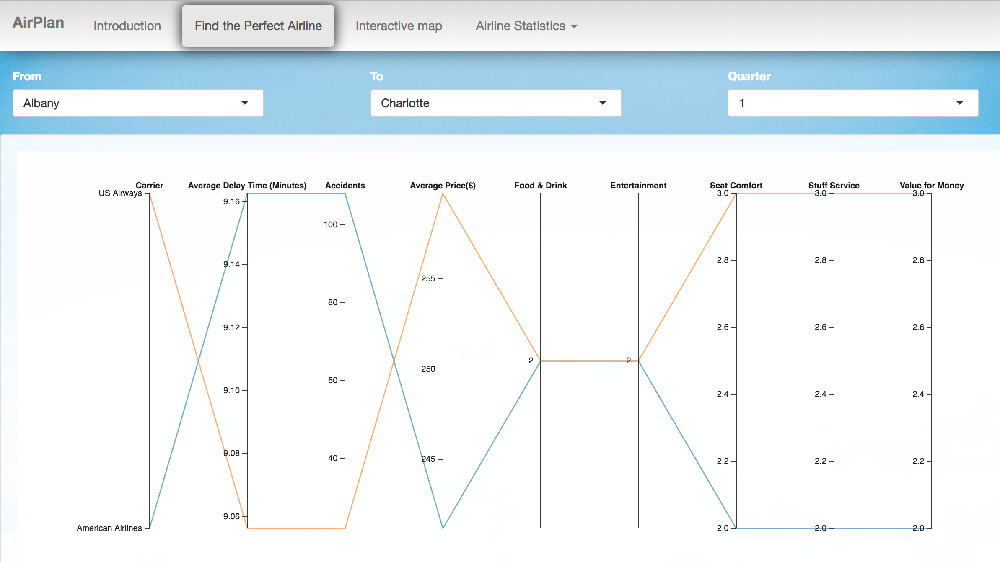
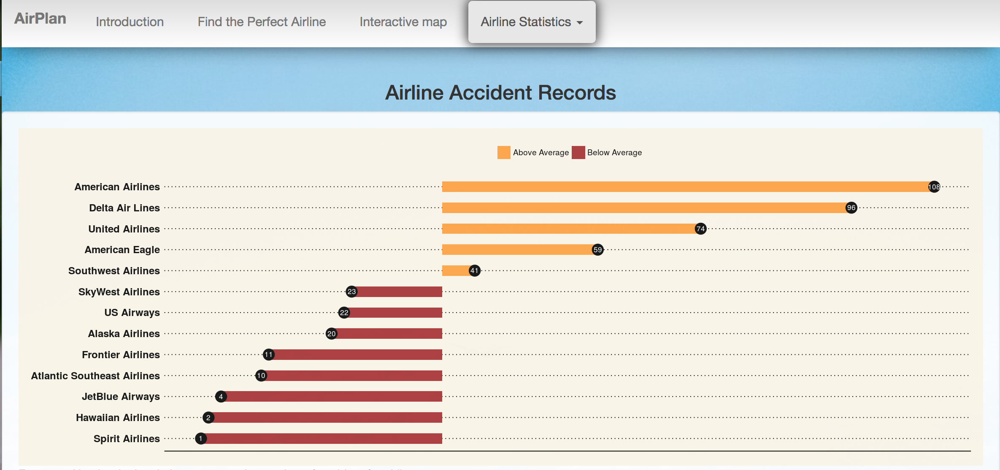

## Open Data App using RShiny - Which Airline is the Best to Fly?

+ This is a modified version of the <a href="https://github.com/TZstatsADS/Spring2018-Project2-Group5" target="_blank">Rshiny team project</a>

+ **Link to Shiny App:**   <a href="https://jingyiwang.shinyapps.io/AirPlan/" target="_blank">https://jingyiwang.shinyapps.io/AirPlan/</a>


## Introduction

Millions of people fly on US airlines every month and a good flying expereince always makes for happier travel. In this project, we developed a app called **AirPlan** and the goal is to help customers choose the best airline to fly with. In particular, we focus on 14 major US airlines and provide airline choices based on their on-time performance, safety performance, luggage handling, in-flight service, and price.


## What is the Business Problem Solved?
Which airline is the best to fly is a problem faced by many travellers before their trip. **Airplan**, unlike traditional airline planning websites which focus primarily on in-flight service or price, dugs through more criteria covering every aspect of each airline’s operations.

## Criteria
1. On-time performance
2. Safety performance
3. Average price
4. Food & Drink
5. Entertainment
6. Seat comfort
7. Stuff service
8. Value for money
9. Luggage handling


## App Images





## Contribution Statement 


Hongyu Li: "I finished the tab named ‘Find the perfect airline’ and ploted parcoordinates for recommendation."

Jingyi Wang: "I finished the work of designing user unterface for the project; data cleaning and server part for Tab1"

Qianli Zhu: "I finished the work of page designing and feature building for Tab1."

Yiran Jiang: "I finished the code part of Tab2 with Du Guo and contributed to data mining and cleaning."

Du Guo: "I finished the code part of Tab2 with Yiran Jiang and contributed to image processing."

## References
Data Source: [https://www.transtats.bts.gov/](https://www.transtats.bts.gov/)

Following [suggestions](http://nicercode.github.io/blog/2013-04-05-projects/) by [RICH FITZJOHN](http://nicercode.github.io/about/#Team) (@richfitz). This folder is orgarnized as follows.

```
proj/
├── app/
├── lib/
├── data/
├── doc/
└── output/
```

Please see each subfolder for a README file.

